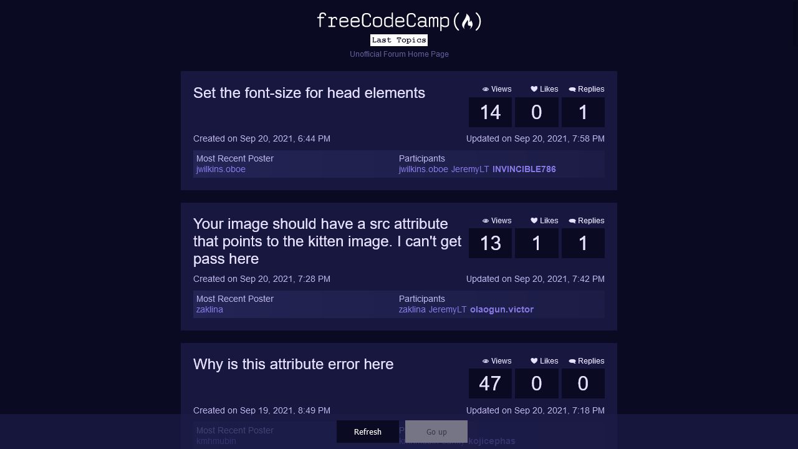

# FreeCodeCamp Forum Homepage

[Live]()

## Description

An app that lists last topics/posts from freeCodeCamp forum. 

## Technologies Used

- HTML
- CSS / Grid
- React
- React Styled Components

**Objective:**

Fulfill the below [user stories](https://en.wikipedia.org/wiki/User_story). Use whichever libraries or APIs you need. Give it your own personal style.

**User Story:** I can see a list of the most recent posts on the freeCodeCamp forum.

**User Story:** For each topic, I can see the title and a list of links to users who have recently posted in it.

**User Story:** I can see the number of replies and views that each topic has had, and a timestamp of when the topic was last active.

**Hint:** To get the 30 most recent forum posts: <https://forum-proxy.freecodecamp.rocks/latest>.