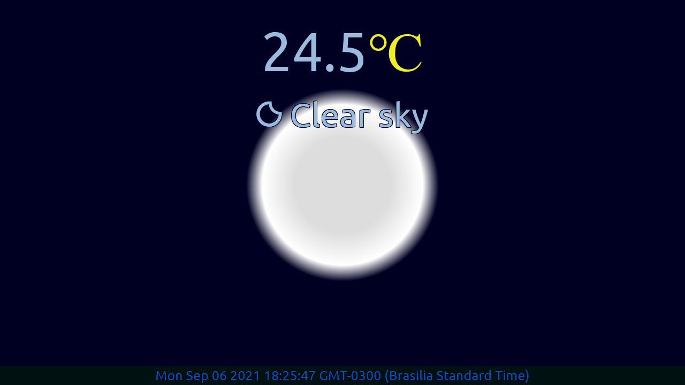

# Local Weather

[Live]()

## Description

Shows information about the weather to the user, changing the page design based on the time and data gathered from GeoIp-DB and OpenWeatherMap APIs.

## Technologies

- HTML
- CSS
- JavaScript
- jQuery

## Objective

Build a local weather app that fulfills the below user stories. Use whichever libraries or APIs you need. Give it your own personal style.

- **Rule #1:** Don't look at the example project's code. Figure it out for yourself.

- **Rule #2:** Fulfill the below [user stories](https://en.wikipedia.org/wiki/User_story). Use whichever libraries or APIs you need. Give it your own personal style.

- **User Story:** I can see the weather in my current location.

- **User Story:** I can see a different icon or background image (e.g. snowy mountain, hot desert) depending on the weather.

- **User Story:** I can push a button to toggle between Fahrenheit and Celsius.
