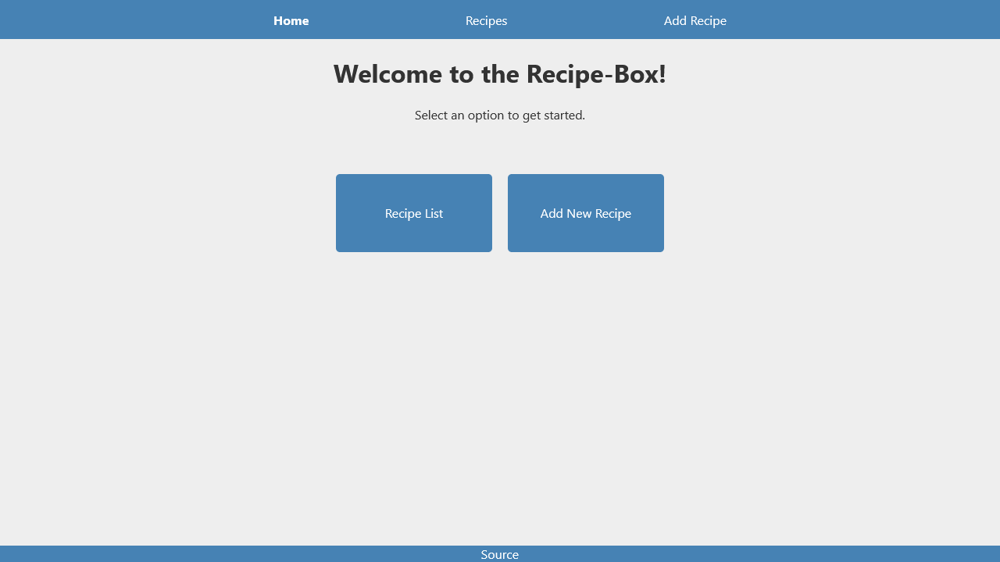

# Recipe Box App

[Live]()

## Description

An app that lets you manage a list of recipes, allowing to add, edit, delete, besides checking the list.

## Technologies Used

- HTML
- CSS / Flexbox
- React
- React Router DOM
- localStorage

## Objective

Build a recipe box app that fulfills the below user stories. Use whichever libraries or APIs you need. Give it your own personal style.

### User Stories

- **User Story:** I can create recipes that have names and ingredients.

- **User Story:** I can see an index view where the names of all the recipes are visible.

- **User Story:** I can click into any of those recipes to view it.

- **User Story:** I can edit these recipes.

- **User Story:** I can delete these recipes.

- **User Story:** All new recipes I add are saved in my browser's local storage. If I refresh the page, these recipes will still be there.