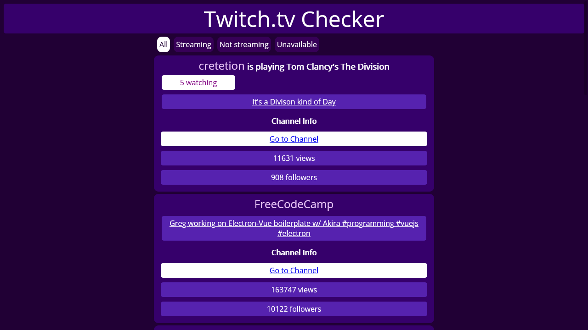

# Twitch Checker

## Description

Shows information about selected channels and streams, using the Twitch API (through the FreeCodeCamp passthrough https://wind-bow.gomix.me).

## Technologies

- HTML
- CSS
- JS/jQuery

## Objective

### User Stories

- **User Story:** I can see whether freeCodeCamp is currently streaming on Twitch.tv.

- **User Story:** I can click the status output and be sent directly to the freeCodeCamp's Twitch.tv channel.

- **User Story:** if a Twitch user is currently streaming, I can see additional details about what they are streaming.