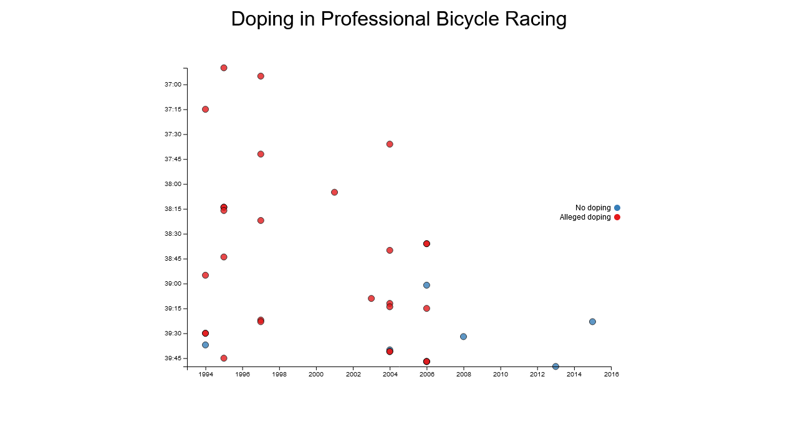

# Scatterplot Graph

[Live](https://jjnilton.github.io/freecodecamp-projects/data-visualization/scatterplot-graph/dist)

## Description

A scatterplot graph with data about doping in professional bicycle racing.

## Technologies

- HTML
- CSS
- JavaScript
- D3.js

## Objective

Build a scatterplot graph fulfilling the following user stories.

### User Stories

- **User Story #1:** I can see a title element that has a corresponding `id="title"`.

- **User Story #2:** I can see an x-axis that has a corresponding `id="x-axis"`.

- **User Story #3:** I can see a y-axis that has a corresponding `id="y-axis"`.

- **User Story #4:** I can see dots, that each have a class of `dot`, which represent the data being plotted.

- **User Story #5:** Each dot should have the properties `data-xvalue` and `data-yvalue` containing their corresponding `x` and `y` values.

- **User Story #6:** The `data-xvalue` and `data-yvalue` of each dot should be within the range of the actual data and in the correct data format. For `data-xvalue`, integers (full years) or `Date` objects are acceptable for test evaluation. For `data-yvalue` (minutes), use `Date` objects.

- **User Story #7:** The `data-xvalue` and its corresponding dot should align with the corresponding point/value on the x-axis.

- **User Story #8:** The `data-yvalue` and its corresponding dot should align with the corresponding point/value on the y-axis.

- **User Story #9:** I can see multiple tick labels on the y-axis with `%M:%S` time format.

- **User Story #10:** I can see multiple tick labels on the x-axis that show the year.

- **User Story #11:** I can see that the range of the x-axis labels are within the range of the actual x-axis data.

- **User Story #12:** I can see that the range of the y-axis labels are within the range of the actual y-axis data.

- **User Story #13:** I can see a legend containing descriptive text that has `id="legend"`.

- **User Story #14:** I can mouse over an area and see a tooltip with a corresponding `id="tooltip"` which displays more information about the area.

- **User Story #15:** My tooltip should have a `data-year` property that corresponds to the `data-xvalue` of the active area.